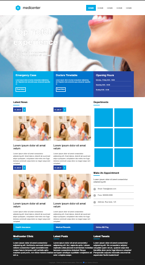

# MEDICENTER SITE

  <b>Site template para clínica médica.</b>

  

## Conteúdo

- [MEDICENTER SITE](#medicenter-site)
  - [Conteúdo](#conteúdo)
  - [:bookmark: Sobre](#bookmark-sobre)
  - [:rocket: Tecnologias Utilizadas](#rocket-tecnologias-utilizadas)
  - [:recycle: Como contribuir](#recycle-como-contribuir)

## :bookmark: Sobre

Site template de uma clínica médica, realizado para estudos do uso de display:flex e responsividade para o mobile com inclusão de um menu hamburguer para abaixo de width:600px.

## :rocket: Tecnologias Utilizadas

O projeto foi desenvolvido utilizando as seguintes tecnologias

- [HTML 5](https://www.html.com/)
- CSS
- [JavaScript](https://javascript.com/)

## :recycle: Como contribuir

- Faça um Fork desse repositório,
- Crie uma branch com a sua feature: `git checkout -b my-feature`
- Commit suas mudanças: `git commit -m 'feat: My new feature'`
- Push a sua branch: `git push origin my-feature`

---

<h4 align=center>Made with 💙 by <a href="https://www.linkedin.com/in/gabriel-h-oliveira/">Gabriel Oliveira</a></h4>
